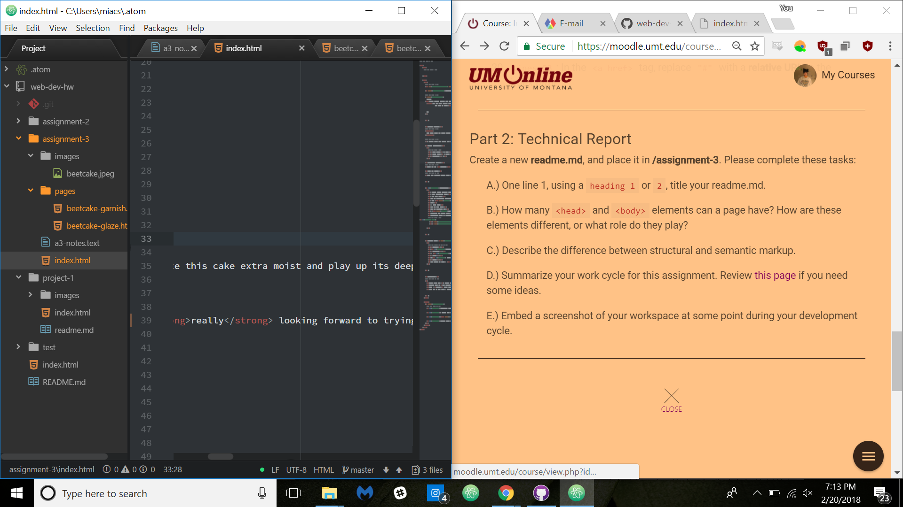

# Technical Report
## by Mia Soza

You can have as many head and body elements as you wish, however it's standard practice to have <b>one</b> head and <b>one</b> body.

The head has data that tells search engines and devices the necessary information about your webpage. There's only one required element, the page's doctype declaration, but it's recommended that one adds a title, and a meta tag.

The body is home to the brunt of your website -- including structural elements such as headings and paragraphs.

We use semantic markup to sort the meaning of information in document, as well as create emphasis through stylistic keywords. Structural markup, on the other hand, is the skeleton of your code -- it's here we create the structural elements of a document, forming the visual layout through different tags.

<b>Work Cycle</b>

I had a pretty run of the mill work cycle for this assignment -- I followed the directions, messed up my e-mail link half a dozen times, couldn't remember what a relative URL was, and then got it all together. I'm starting to see patterns and understand how code interacts with itself, so I just needed to refer to past assignments in order to find previous solutions to current problems.

Here's a peek at my workstation!

