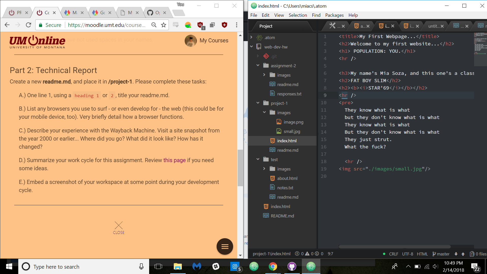

# Project One: ReadMe
## Mia Soza

Chrome is probably my most used browser, with Safari following at a considerable distance. I'm preeeeetty sure I used Internet Explorer up until 2010 though.

A browser is the only way of accessing, editing, adding, and interacting with the Internet. There are multiple choices availaible, and generally personal preferences or specific needs determine which one a person chooses.

The Wayback Machine is so tight! We'll use it to dig around the KBGA website somemtimes -- it's so funny seeing the ridiculous websites people used to make. I really want to keep my first website floating around so that I can visit it years in the future just to check it out.

